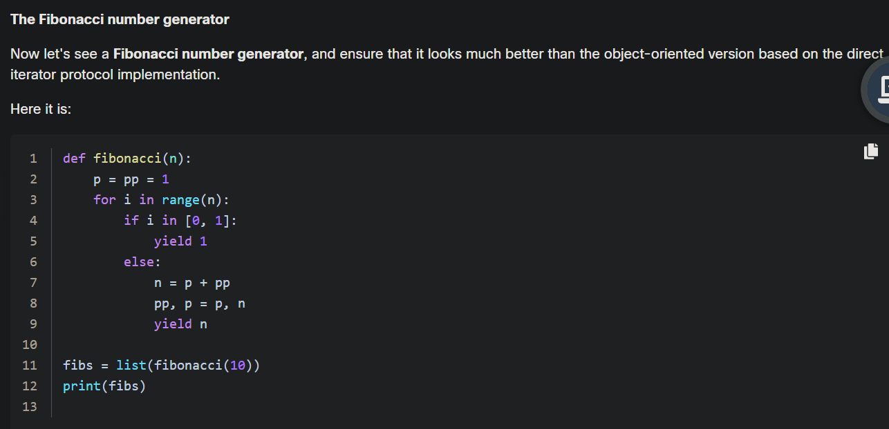
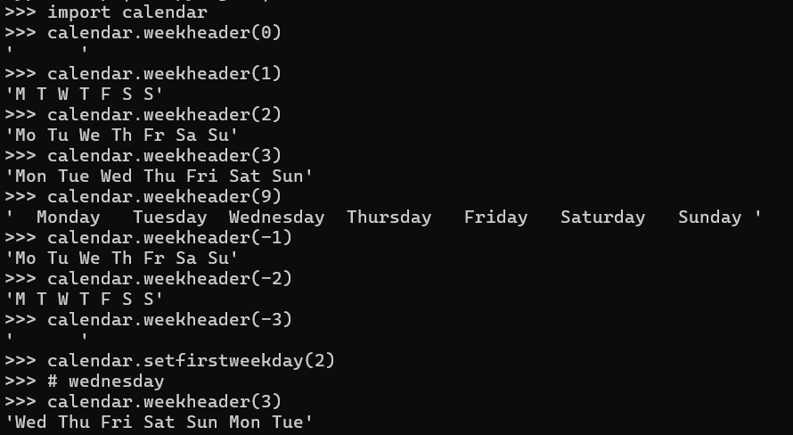
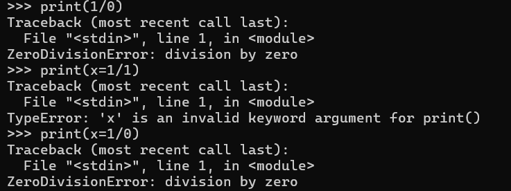

# general


1) executing source code is done by interpreter or runtime environment
2) compiler translate the source code into bytecode(not machine code which is binary) __and__ check the source code in order to see if its correct , The Python interpreter (specifically, the Python Virtual Machine — PVM) then executes that bytecode.

```python
# e or E
3425e2 => 3425*(10**2) => 342500
.3425e2 => 0.3425*(10**2) => 34.25
3425e-2 == .3425e2
# seperateur in print function
print("one","two","three",sep='"') => 'one"two"there'
# print with end param
print("*",end="") # by default print("*") will print *\n (end="\n")
# example
for i in range(2):
    print("*",end="")
else:
    print("*")
# prints in one line ***
# for loop and while has else
# when the condition is not true it executes else one time
i=0
def function():
    while(i!=0):
        i=i-1
    else:
        i=i+1
    print(i)
# this returns i=1
i=5
function() # even if i=5 it returns i=1
# else always executing but it doesn't only when there is break inside while

# parameters and arguments
def function(a): # a here is a parameter
function(6) # its an argument
```
### keyword
```python
#keyword are special words in python programming like
if , else , elif , def , return , for , while , in , not , lambda , True , False , raise
# we cannot use these as variable it raises SyntaxError
if=5 # SyntaxError
False=5 # SyntaxError
# but predefined function can be overriden
print=5 , len="string" # works and u cant use the function again
# positional arguemnt and keyword argument
def greet(name, message):
    print(f"{message}, {name}!")
greet('alice','hi') #  positional argument Python knows which value goes to which parameter based on their position
greet (message='hi',name='alice') # keyword(named) argument
greet (name='alice','hi') # SyntaxError
```
### UTF-8 , ACSII And unicode
__unicode__ A standard for representing text in almost every writing system.

__ASCII__(American Standard Code for Information Interchange)
Only supports 128 characters (0–127), e.g., English letters, digits, and punctuation.

__UTF-8__(Unicode Transformation Format - 8-bit)
A variable-length encoding for Unicode it uses from 1 to 4 bytes ( not 8 bytes ) 

__BOM (Byte Order Mark)__ is a special combination of bits announcing the encoding used by a file's content (eg. UCS-4 or UTF-8).


```
Ascii is a character set (and encoding)
unicode is a character set
utf-* are encoding
```
### yield in python
__its like return but waits__



### is in python
```python
5 is 5 => True
5 is 6 => False
5 is True => False
5 is False => False
ch="hello"  ch1="hello" # both share the same memory cuz they have the same string
ch is ch1 => True
ch="hello" ch1="hell"  ch1+="o"
ch is ch1 => False # car strings are immutable thats why when we did ch1+="o" , ch1 created again with a different memory
ch == ch1 => True
a=5 b=4 a is b => False then b+=1 , a is b => True
a=(1,2,3) b=(1,2,3) a is b => False
a=(1,2,3) b=copy.deecopy(a) a is b => True
a=[1,2] b=[1,2] a is b => False
class A:
    pass
a=A() , b=A() a is b => False a == b => False
```
3) list are mutable means they can change using del or add
but tuple and strings are immutable

list and tuples can store any type of data
```python
my_tuple = (True, "hello", [1, 2, 3], (4, 5))
my_list = [False, "world", (4, 5), [6, 7]]
# del my_tuple[1] raises TypeError exception (strings too)
```
**Question** : Which of the following sentences are true?

a) lists may not be stored inside tuples

b) tuples maybe stored inside lists

c) tuples may not be stored inside tuples

d) lists may be stored inside lists

`b,d are correct cuz lists and tuples maybe stored inside lists and tuples`
### annonymous functions (lambda)
```python
func=lambda x:x*x
func2=lambda a,b:a+b
func2(5,2)=7
# this is like a normal function using def
# the use of lambda not for this
# its for creating a function without a name
def squares(l,func3):
    for i in l:
        print(func3(i),end=",")

squares([1,2,3,4,5],lambda x:x*x) => prints 1,4,9,16,25,
```
### list competense
```python
l=[i for i in range(10)]
l=[i for i in range(10) if i%2==0] # using else after if here will cause SyntaxError
l=[0 if i%2==0 else 1 for i in range(10) ] # using this syntax without else will cause SyntaxError
l=[[i for i in range (10)] for j in range(3)]
```

### map and filter
```python
func=lambda x:x**2
l=[1,2,3,4]
m=map(func,l)
# two options : list(m) gives the whole result of the list in a list | or next(m) return numbers one by one if it reaches the end and execute next(m) again it will raises StopIteration exception
l1=list(m) # [1,4,9,16]
#or
print(list(map(lambda x:x**2,[1,2,3,4])))
# filter
print(list(filter(lambda x:x%2!=0,[1,2,3,4]))) => returns [1,3]
emails=["user@gmail.com","anothermail","anotheruser@gmail.com"]
# give the valid emails
print(list(filter(lambda x: "@" in x,emails)))
```

`cuz it is a pointer`


```python
def is_even(n):
    if n % 2 == 0:
        return True
    # else returns None by default (which is falsy)

nums = [1, 2, 3, 4, 5]
result = filter(is_even, nums)
print(list(result))  # Output: [2, 4]
```
```python
def version(x):
    return # or return None or pass or None (not True or False)
l=[1,2,3,4,5,6]
print(list(filter(version,l))) => []
print(list(filter(None,l))) => [1,2,3,4,5,6]
print(list(filter(version,l))) => []
print(list(filter(version(anythinghere),l))) => [1,2,3,4,5,6]
# cuz print(version(AnyArgument)) => None
def version2(x):
    return "1"
print(list(filter(version2,l))) => [1,2,3,4,5,6]
print(list(filter(version2(anyArgument),l))) # TypeError "str" object is not callable
x=list(filter(print,l)) =># 1 \n 2 \n 3 \n 4 \n 5 \n 6 \n a normal print 
# but x is []
print(list(filter(print(),l))) => [1,2,3,4,5,6]
# cuz type(print) => builtins type(print()) => NoneType
print(list(filter(type,l))) => [1,2,3,4,5,6]
print(list(filter(int and str and bool and float and type,l))) => [1,2,3,4,5,6]
print(list(filter(type(1),l))) => [1,2,3,4,5,6] # x=type(1) type(x) => int

print(list(filter(None and str and int or '1' or float and type(1),python)))
# TypeError
print(list(filter(None and str and int or '1' and float and type(1),python))) => [1,2,3,4,5,6]

```
### closures


### text and binary files handling
`text files => .txt .py .csv .json .yml .xml .log .ini .html .cfg .tsv .rst ....`

`binary files => .bin .exe .docx .dat .img .zip .tar .pdf .class ...`


creating binary array :

modes :

predefined streams :


stream errors :


```python
file=open('abc.txt','a+') # means append and read
file.read() # empty string
file.seek(0) # u can now use file.read()
file.write('abc') # always in the end of the file even using file.seek(0) (can be useful only while reading)
```
# ObjectOrientedProgramming
4 sections : inheritance , abstraction , polymorphism(overriding properties) and encapsulation (private properties)

```python
# constructor in python can only return None or return nothing
def __init__(self):
        return #(return None / pass)
class animal:
    def __init__(self,name,age):
        self.name=name
        self.age=age
cat=animal("cat",1)
print(cat.name) # public property of animal cat
# how to make it private accessible only inside the class
# it called encapsulation
class animal:
    def __init__(self,name,age):
        self.__name=name
        self.age=age
dog=animal("dog",2)
print(dog.__name) # raises AttributeError
print(dir(dog)) or print(dog.__dict__)
# dir() return list but __dict__ returns dictionnary
# we find that __name attribute exist , but its private cuz it can be accessible only if we knew the name of the class
print(dog._animal__name) # its called name-mangled (even methods can be name-mangled def __format() )
_sound # one underscore ( protected attribute ) but still public
dog.__status = "anything" # if we add the property later (using double underscore)
print(dog.__dict__) # shows attribute as __status = "anything" without name mangling
name , age # called attribute or instance variables or object variables
# class variables are variable defined inside the class only
class animal:
    counter=0
    def __init__(self,name,age):
        self.name=name
        self.age=age
        animal.counter+=1

pet=animal("cat",2)
print(pet.counter) or print(animal.counter)
# counting how many instances created from this class
# if it is __counter => print(animal._animal__counter)
```
__class cannot access object or instance variables__
```python
# example look at animal class
print(animal.name) # Raises AttributeError
# but instance can access class and instance variables
# both class and instances can access fonctions or methods
hasattr(animal,'__init__') => True
hasattr(pet,'__init__') => True
# but both different
type(animal.__init__) => <class 'function'>
type(pet.__init__) => <class 'method'>
# so thats why when we call animal.__init__() only we get error (self argument not applied ...)
# we can access it only with animal.AnyMethod(pet) will be the same as we called pet.AnyMethod()
```

counter is not a variable of instance but when u do __pet.counter__ it prints out the value and __isattr(pet,'counter')__ is True cuz first it lookup for that in __pet.\_\_dict\_\___ not found then looks for __animal.\_\_dict\_\___ ( found here ) but it not found it looks for the parent class it walks up the inheritance chain
```python
pet=animal("cat",2)
print(animal.__dict__) # we can find __name__ attribute but it can be used only on the class
type(int).__name__ => type # it displays the class name
print(animal.__name__ ) => "animal"
# we can print it using the instance
print(type(pet).__name__)

# __str__ method in class used for print
def __str__(self): # add this to animal class
    print("animal name is :",self.name, "and age is : ",self.age)
pet=animal("dog",5)
print(pet) => "animal name is : dog and age is : 5"
```
## introspection and reflection
__introspection__ : means examine type of properties of an object in runtime

like __type(obj)-isinstance(obj,(class,class,...))-getattr(obj,attr_name)-hasattr(obj,attr_name)__
```python
class A:
    pass
class B:
    pass
class C(B):
    pass

c=C()
print(isinstance(c,(A,B))) => True # it look in both classes if one of them is true it returns true
print(isinstance(c,(A,B,B,B,A,A,..))) => True
```

__reflection__ : means the ability to change a property of an object in runtime like __setattr(obj_name,attr_name,value)__

## inheritance
```python
class vehical:
    pass
class landvehical(vehical):
    pass
class car(landvehical):
    pass
issubclass(car,landvehical) => True
issubclass(landvehical,vehical) => True
issubclass(car,vehical) => True
issubclass(car,car) => True
```


## multiple inheritance


## for oop
__type object it means class__
```python
class myclass:
    pass
type(myclass) <class 'type'> # thats why its called type object
type(myclass()) <class '__main__.myclass'> # its called myclass object
```

`return will raise error`
```python
class Class:
    "fsdf"
Class() # works fine
```
# operators

## Arithmetic operators
```python
1-+2 = 1+-2 = -1
1+++++2 = 3 # is valid with any amount of + and - 
1-----2 = 1---+2 = 1-+2 = -1
1+-+-+---+2 = -1
++1 = 1 , --1=1
1++ or 1-- # is invalid (raises SyntaxError exception)
```
## Logical operator
```python
# and
# a and b (a,b types can be anything)
# if a is falsy (means 0,False,[],(),'',"",None) it returns a
# if a is truthly (means anyThing Not empty in any type) it returns b
# classes type objects are truthly
# __name__ truthly too
5 and 6 => 6
5 and False => False
0 and 6 => 0
6 and 0 => 0
0 and False => 0
False and 0 => False
5 and " " => " "
" " and 5 => 5
int and str => <class str>
str and int => <class int>
# or
# if a is falsy it returns b
# if a is truthly it returns a
6 or 0 => 6
6 or 10 => 6
False or 0 => 0
0 or False => False
int or str => <class int>
str or int => <class str>
# not
# not a => True ( if a is falsy) the opposite is False
not 0 => True
not AnyNumber => False
True or True and False or False => True # and is evaluated first
# so it is like that
True or (True and False) or False => True or False or False => True

```
## bitwise operators
`NOT Shift AND XOR OR`
```python
A=4,B=2
# both in binary A(100)B(010)
print(A&B) => 0 # cuz 100&010 is 0
5'00000101' >> 1 => 2'00000010'# shift right 
5'00000101' << 2 => 20'00010100'# shift left
# OR | AND & shift << >> not ~ xor ^
~x = -x - 1
~5 = -6
~-5 = 4
~~5==5 => True
5(101)|2(010) => 7(111)
# priorities
# ~ << >> & ^ | (~ has highest priority while | has lowest priority)
```

# Strings
1) python strings are immutable means u cant change it , but u can override it __like tuple__
-we cant get ride or change some characters of the string like using del string[0] (works only in lists)
2) operator overloding (+ *) in strings are different
3) \* is commutative in strings but __+__ not commutative (anticommutativity)
4 * "A" = "A" * 4
4) __in__ __not in__ operations like __("A" in "Ahmed")__
## functions
python methods
```python
ord(chr(codePoint))= codepoint
min("abcd")="a" # char with a minimum codepoint 
max("abcd")="d"
"abcda".count('a')=2
"string".index('s') => 0
"string".find('s') => 0
"another".index("no") => 1
"another".find("no") => 1
# when the string isnt there index raises ValueError exception
"another".index("yes") => Exception error
"another".find("yes") => -1 ( not found )
"string".find(Sub[, start_index[, end_index]])
"non non".rfind("non") => 4 (find but starts from the end)
"tau tau tau".rfind("ta", 3, 9) = 4 # third param number excluded
"string101".isalnum() => True (alphanumeric)
"string".isalpha() => True
"101".isdigit() => True
"string".islower() => True
"STRING".lower() => string
"STRING".isupper() => True
"string".upper() => STRING
"StRiNg".swapcase() => "sTrInG"
" ".isspace() => True ( '\n' '\t')
# join , split , list
List = ["PCAP","Exam"]
Seperateur = " "
String = Seperateur.join(List) => "PCAP Exam" (seperated by space)
String.split(Seperateur) => ["PCAP","Exam"]
# sorting (sort() method or sorted() function)
Names = ["basem","ahmed"]
Names.sort() => ["ahmed","basem"] # will change the original copy
# list
list("abcd") => ['a','b','c','d']
# but sorted() returns a new list
SortedList=sorted(Names) 
# more methods
'aBcD'.capitalize() => 'Abcd' # changes first char to uppercase (if there is uppercase to that) and the rest to lowercase
'this iS a tESt'.title() => "This Is A Test" # title is like capitalize and works for a phrase too
'this iS a tESt'.capitalize() => "This is a test"
string.center(10[,charToAdd])
"ahmed".center(10,"*") => "**ahmed***" # adds * to both side to get 10 chars (right side gets extra char if its odd chars to add)
"epsilon".endswith("on") => True
" name ".lstrip() => "name " # (left strip )removing all left whitespaces
" name ".rstrip() => " name"
" \n name \t ".strip() => "name" # strip left and right
"www.cisco.com".lstrip("w.") => "cisco.com" # remove w . chars occurence from the left stops when it finds different char
print("["+" tauauuaua ".rstrip("au ")+"]") => "[ t]" # removes 'a','u',' ' occurence from right stops when it finds different char
print("["+" auautauauuaua ".strip("au ")+"]") => "[t]"
"yesmanyes".replace("yes","no") => "nomanno" # replace first argument by second
"yesman".replace("yes","") => "man"
"1test2121".replace("1","",2) => "test221" # third param replace number (replace only 2 times here)
"it is easy or impossible".replace('easy', 'hard').replace('im', '') => "it is hard or possible"
"yes".replace("","A") => "AyAeAsA" # if first argument empty it adds second argument before and after every char

```
## Comparaison
```python
# == works only if both same string
#  > < it compares each charater in both by code points
"I love python" > "I love Python" => True #code point of 'p' > code point of 'P'
"Pythonist" > "Python" => True # compare with the length if shortest string is identical to the start of the other string
"Pythonist" > "Z" => False # code point of Z > code point of P
"20" > "8" => False
# Numbers
"10" == 10 => False # number never equal string number
# using > < in numbers compared with string numbers will cause error (TypeError exception)
# comparing 2 different types causes error only using == (no error)
```
## conversion
```python
str(AnyThing) # any valid variable works
str('string') str(True) str([]) # all works
int("10")
int("10.0") => ValueError Exception
float("10.0")
```
# Exception


```python
raise Exception_Type() # raise only used to classes that inherits from BaseException or Exception
######## raise ...(args) executes __init__(param)
import sys;sys.exit() # raises SystemExit exception
# KeyboardInterrupt => when u interrupt the execution by pressing keys like ctrl+c or stop button
t=['1','2'];t[2] # raises IndexError Exception
d={'michael':15};d['ahmed'] # raises KeyError Exception
'string'+10 # raises TypeError Exception
int('string') # raises ValueError
obj.name # if attribute name doesn't exist it raises AttributeError
x=x+1 # if x doesn't exist : UnboundLocalError local variable 'x' referenced before assignement
try:
    c=a/0
except:
    print("there is an exception")
# exception here is ZeroDivisionError and it is ArithmeticError too (general)
###
try:
    c=a/0
except ArithmeticError:
    print("arithmetic exception")
except ZeroDivisionError:
    print("division exception")
# here ArithmeticError is raised cuz it is first (both of the exception handle the error)
assert(b!=0),"b is zero" # this will raise "AssertionError: b is zero" if b == 0
try:
    return 1/b
except:
    return None
else:
    print("success")
finally:
    print("im always printed")
# else can be used in try except but not useful (executes when there is no exception raised)
# finally always in the end of the try except statement , it always execute ( doesn't matter the exception raised or not )
try:
    return 1/b
except:
    print("there is an error")
    raise
# raise is only used in try except , it raises the exception that happened
try:
    print(1/b)
except Exception as e
    print(e)
# it prints Division by 0 even we put except ZeroDivisionError as e or even BaseException

# there is UnboundLocalError under NameError
def p():
    x=x+1
p() # will raise UnboundLocalError local variable 'x' referenced before assignement
# but if it is not in local
aaa=aaa+1 # for example will raise NameError 'aaa' is not defined
```

#### Question Example :
```python
class myException(Exception):
        def __init__(self,message):
            super().__init__(message)
            print("Hello",end=" ")
        def __str__(self):
            return "A"
try:
    raise myException("BB") # one argument cuz __init__ has one param
    print("no")
except myException as e :
    print(e.args)
=> Hello ('BB',) # will print Hello cuz __init__ executed from raise and after that it went straight to the except part prints arguments of myException as e ( tuple )
try:
    raise myException("BB")
except myException as e :
    print(e)
=> Hello A # prints Hello but here with "A" from __str__() method cuz when we print(e) it will execute the override method __str__()
# now without __str__() it will use the default one which is printing parameters of myException
=> Hello BB 
if raise myException("BB","CC") # __init__(self,msg1,msg2)
=> Hello ("BB","CC") # same as print(e.args)
    
```


## Own Exceptions


```python
class 
```
# Modules
```python
# syntax
from random import randint
import random
import math ,sys
from module import n as a, m as b, o as c

```
```python
import math # example
type(math) # is a class
dir(math) # return a list of all subclasses and variables inside math module(class)
print(math.__doc__)#__doc__ is a variable from dir(math) list
type(math.ceil) # ceil is class in dir(math) list
dir(math.ceil) # shows subclasses and variables of subclasse of math (ceil)
```
## Math module
```python
import math
math.floor(3.7) = 3 # Rounds a number down to the nearest integer.
math.floor(-3.7) = -4
math.ceil(3.4) = 4 # Rounds a number up to the nearest integer.
math.ceil(-3.4) = -3
math.trunc(3.1) = 3 # just moving decimal part 
math.factorial(3) # accept only int (if float or any other type will raise TypeError exception)
math.sqrt(16) = 4.0 # raises ValueError if the param is negative
math.hypot(3,4)=5.0 # hypothenes
```


### Random module
```python
import random
random.randint(0,10) # random from 0 to 10
random.randrange(10) # random from 0 to 9 (exclude 10)
random.randrange(10,100,3) # (start , stop , steps) random from 10 to 99 with 3 steps
random.randrange(100,10,3) #raises ValueError if start >= stop
random.random() # always random number with a different seed (from local time) between 0.0 and 1.0
random.seed(0) # we can choose seed number and after any execution of the same random.random() will have the same number
random.choice(list) # return one element from a list (or tuple or string or dict)
random.choices(list,k=5) # return a list of elements even one element its a list and k here is a keyword for the sequence (how many elements 'its optional')
random.sample(list,num_elements) # takes num_elements not duplicate from list and return a list of those elements randomly (num_elements should be less than length of the list)
random.sample([2,3],2)
# return a list of 2 elements here randomly
# can be [2,3] or [3,2]
# if len(list) equal num_elements it will return the same list (randomly)
# can be strings,tuple,dict other than list
# different between these
random.sample([2,3],2) # this cant be [2,2] or [3,3]
random.choices([2,3],k=2) # this can be [2,2] or [3,3]
```

### platform module
```python
import platform
platform.platform() # return OS with release it takes 2 arguments False or True value but its the same result
platform.system() # returns OS (Windows or Linux)
platform.machine() #  CPU architecture (example : x86)
platform.processor() # returns CPU name /model if available exp : Intel(R) Core(TM) i3-2330M CPU @ 2.20GHz or x86
platform.version()# detailed kernal version and info
platform.python_implementation() # exp : CPython
platform.python_version() #'3.10.12'
platform.python_version_tuple() # ('3','10','12')
platform.release() # os version
```
### os module
```python
import os
x=os.system('commandLine Code')
print(x) # returns exit status 0, which indicates success on Unix systems if not returns 1
os.uname() # returns platform.system() , plaform.release() , platform.version() , platform.machine()
# returns class posix....
os.makedirs('dir1/dir2') # for creating directories
os.removedirs('dir1/dir2')
```

### getting current date and creating date objects
```python
# datetime module has date class
import datetime
x=datetime.date(2025,5,2) # its type is datetime.date class
y=datetime.date(2024,5,2)
x-y => datetime.timedelta(days=365) # its type is datetime.timedelta class
print(x-y) => 365 days , 0:0:0
# create datetime.timedelta object
delta=datetime.timedelta(weeks=,days=,hours=,minutes=,seconds=)
#delta has only 3 attributes
delta.days delta.seconds delta.microseconds
delta*2 ; delta1+delta2 ; delta1-delta2 ; delta1/delta2 # returns float
# if keyword argument repeats it raises SyntaxError exception
# works like that even x and y datetime.datetime
# but - with datetime.time() is typeError
# + typeError for datetime , date and time
# ==, !=, <, >, <=, >= works fine in all
# delta can be added to anything but not datetime.time object
x.day => 2
x.month => 5
x.year => 2025
# we can create date object from timestamp (seconds from 1 jan 1970 until now )
import time
time.time() # to get timestamp
time.sleep(seconds) # time module has sleep method too
l=time.ctime(time.time()) # convert timestamp to date with this format 'Tue May 20 13:56:46 2025'
gm=time.gmtime(timestamp) # create struct_time object in UTC from timestamp
local=time.localtime(timestamp) # like gmtime but in local not UTC
time.mktime(gm or local)# convert struct_time object or a tuple to timestamp
time.asctime(gm) # return string of date from struct_time object or a tuple to 'Tue May 20 13:56:46 2025'
# if it a tuple
time.struct_time(tm_year=2019, tm_mon=11, tm_mday=4, tm_hour=14, tm_min=53, tm_sec=0, tm_wday=0, tm_yday=308, tm_isdst=0)
# tm_wday(weekday from 0 to 6) tm_yday(yearday from 1 to 366)
#tm_isdst is daylight saving time (if 1 true if 0 false -1 no idea) but in gmtime always 0
# should be with 9 arguments each positional arguments represent time.struct_time argument
time.mktime((2019,11,4,14,53,0,0,308,0)) # return timestamp
time.asctime((2019,11,4,14,53,0,0,308,0)) # date
datetime.date.fromtimestamp(time.time()) # gets date object from timestamp
# changing date object
x.replace(year=2024,month=1,day=1) # output new date object but doesn't change x
x.weekday() # 0 is Monday and 6 is Sunday
x.isoweekday() # 1 monday 7 sunday
from datetime import time
x=time(14,25,5) # object from datetime.time class
x.hour => 14
x.minute => 25
x.second => 5
# class datetime combine date and time
import datetime
# only datetime.datetime object has timestamp function (x is datetime.datetime object)
x.timestamp()
datetime.datetime(year,month,day,hour,minute,second,microsecond,tzinfo,fold)
datetime.datetime.today() # today date and time object from datetime.datetime class
datetime.datetime.now() # same as today() but tz argument is the difference
datetime.datetime.today().timestamp() # its like time.time()
x=datetime.datetime(2019,2,4,14,58)
print(x) "2019/02/04 14:58:00"
x=datetime.date(2019,2,4)
print(x) "2019/02/04"
# strftime exp : x is datetime.datetime or .time or .date object
x.strtime("%Y/%b/%d %H:%M:%S") # works fine in any type even (time that doesnt have date and date that doenst have time)
x=datetime.time(15,2,25) print(x)# 15:02:25
x.strftime("%Y/%b/%d %H:%M:%S")# 1900/Jan/01 15:02:25 %B Janvier %m 01
x=datetime.date(2020,10,5)
x.strftime("%Y/%m/%d %H:%M:%S")# 2020/10/05 00:00:00
# strftime in time module
import time
x=time.strftime("%Y/%m/%d %H:%M:%S") # x is string of the current time
x=time.strftime("%Y/%m/%d %H:%M:%S",struct_time_obj) # string formated of struct_time object
# strptime creates datetime.datetime from a string and format
x=datetime.datetime.strptime("2019/04/11 14:58","%Y/%m/%d %H:%M")
# can use any format u want in the end return datetime.[...] object , print(x) stays the default format
import time
time.strptime("2019/04/11 14:58","%Y/%m/%d %H:%M") # creates time.struct_time object
```

```python
# ways to create time.struct_time object 
# 1
import time
t = time.strptime("2025-05-24 14:30", "%Y-%m-%d %H:%M")
# 2
import time
t = time.struct_time((2025, 5, 24, 14, 30, 0, 5, 144, 1))
# 3
import time
timestamp = 1716552600
t = time.localtime(timestamp)  # Local time
t_utc = time.gmtime(timestamp)  # UTC
```
### Calendar
```python
import calendar
print(calendar.calendar(2020))
calendar.prcal(2020) # same as calendar.calendar() but without print
print(calendar.month(2020,8)) # only calendar of month 8
calendar.prmonth(2020,8) # same as month without print
calendar.setfirstweekday(calendar.SUNDAY) # start with SUN in the output if printing calendar.[..]
calendar.weekday(2025,5,21) => 2 # wednesday
0 1 2 3 4 5 6 # 'Mon Tue Wed Thu Fri Sat Sun' 
```

```python
import calendar
# leap year multiple 4 not 100 (multiple 100 only if multiple 400)
calendar.isleap(2020) => True
calendar.leapdays(2010,2021) => 3
# creating calendar object
c=calendar.Calendar() # u can put firstweekday in arguments
c=calendar.Calendar(calendar.SUNDAY)
for day in c.iterweekdays():
    print(day,end=" ") # 6(SUN) 0 1 2 3 4 5

for date in c.itermonthdates(2019, 11): # return dates even before month 11 or after , it return dates for 5 weeks not 4
    print(date, end=" ")
#2019-10-28 2019-10-29 2019-10-30 2019-10-31 2019-11-01 ... 2019-11-30 2019-12-01
for iter in c.itermonthdays(2019, 11):
    print(iter, end=" ")
# other method called monthdayscalendar same as itermonthdays but different output its a list the other int
# monthdays2calendar method return list of tuple (monthday,weekday) its like monthdayscalendar but with weekday

```
## Questions


1) give me output of this code :
if b=0 or b!=0
```python
b=int(input("donner b :"))
def function(n):
    try:
        return 1/b
    except:
        return "no"
    else:
        print("elsehere")
    finally:
        print("finally is here")

#### if b=0
'finally is here'
'no'
#### if b!=0
'finally is here'
number
# else is not returned cuz in try there is a return before it reach the else part
# but finally always executes no matter what thats why it executes before return
changing return with print()
#### if b=0
'no'
'finally is here'
#### if b!=0
number
'elsehere'
'finally is here'
```

2) Can a module run like regular code?
__yes, and it can differentiate its behavior between the regular launch and import__

3) What can you deduce from the following statement?

`str = open('file.txt', "rt")`
__t mode is default__

a) str is a string read in from the file named file. txt

b) a new line character translation will be performed during the reads

c) if file.txt does not exist, it will be created

d) the opened file cannot be written with the use of the str variable

__( b,d ) cuz str is not a string and if file.txt does not exist ,it does not create it (it does with w mode)__

__it cannot be written cuz rt(ReadText) mode and as a textFile every new line char will be translated__

4) The first parameter of each method:

a) holds a reference to the currently processed object

b) is always set to None

c) is set to a unique random value

d) is set by the first argument's value

__only a is true__

__we know that every method is defined inside a class with a self (object) as first parameter__

5) Select the true statements:

a) The class keyword marks the beginning of the class definition

b) An object cannot contain any references to other objects

c) A class may define an object

d) A constructor is used to instantiate an object

e) An object variable is a variable that is stored separately in every object

__a,d,e__

__instantiate means create instance from a class, constructor( \_\_init\_\_() method ) its purpose to create an object'__

__object can contain references to other objects__

__object variable means instance variable like:__
```python
class Dog:
    def __init__(self, name):
        self.name = name  # 'name' is an instance variable

dog1 = Dog("Buddy")
dog2 = Dog("Max")
# dog1,dog2 objects
print(dog1.name)
print(dog2.name)
```
6) A Python package named pypack includes a module named pymod.py which contains a function named pyfun().
Which of the following snippets will let you invoke the function?

```
project/
│
├── pypack/(folder)
│   ├── __init__.py
│   └── pymod.py (python code has pyfun())
│
└── main.py
```
A) . from pypack.pymod import pyfun

pyfun()

B) . import pypack

pymod.pyfun()

C) . from pypack import *

pyfun()

D) . import pypack

import pypack.pymod

pypack.pymod.pyfun()

__A,D are true__

__can use import pypack.pymod directly__

__or from pypack.pymod import pyfun__

7) how to make this code right :
```python
def A(a):
    b=a+1
    def B():
        b=b+1
    B()
    return b
print(A(1))
```
__this code will raises UnboundLocalError car B() function doesn't know b variable__

__so we should make it accessible__
✅ Use __nonlocal__ if __b__ is in an __enclosing__ function __A()__.
✅ Use __global__ only if __b__ must be shared across the entire program (rarely needed).
❌ Without __nonlocal/global__, __b = b + 10__ in __B()__ will cause __UnboundLocalError__.




### mutable (list , classes , dict) in parameters defaults values


### more about oop inherite from Exception or BaseException

`this works cuz even overriding __init__ and not using super().__init__(x) or manually changing self.args "failed" still be in self.args tuple`


### raise


### types
```python
type({}) => dict
type({1,2,3}) => set
type({1:5,2:4}) => dict
```
### function parameters
```python
def func(*args):
    return args
func(1,2,3) => (1,2,3) # tuple
func(1) => (1,)
func() => () # empty tuple
def func(**kargs):
    return kargs
func() => {} # empty dict
func(1,2,3,4) # TypeError
func(x=10,y=20) => {'x':10,'y':20}
def func(*args,**kargs):
    return args,kargs
func() => ((),{}) # tuple cuz return variable1,variable2 returns a tuple
func(1,2,3,x=10,y=20) => ((1,2,3),{'x':10,'y':20})
def func(x,y):
    pass
func(1,2) # those are positional arguments
func(x=1,y=2) # keyword(named) arguments
func(x=1,2) # SyntaxError : positional argument follows keyword argument
func(1,y=2) # works
func(2,x=1) # TypeError : got multiple values for argument 'x'
```
### lists
```python
t1=[0,3,1,3]
t1.pop() # remove last value and return it
t3=list(reversed(t1)) =>[3,1,3,0]
# reversed argument type (dict,list,tuple,str,range,)
list(reversed({1:5,2:2,3:4})) => [3,2,1]
list(reversed(1,2,3)) => [3,2,1]
list(reversed({1,2,3})) # typeError 'set' object is not reversible
list(reversed(range(1,4))) => [3,2,1]
t2=t1[3:3] or t1[6:3] => [] # even start is more then end it wont raise exception
[-3,3].index(-3) => 0
t1.insert(1(pos),2(value)) => t1=[0,2,3,1,3]
l=[1,2,3]
for i in l:
    if i==1:
        l.append(4)
    print(i)
# result 1,2,3,4
for i in range(len(l)):
    if i==0:
        l.append(4)
    print(l[i])
# result 1,2,3
# in first loop we are working with the list directly so when it changes it affects the loop
l2=l1.copy() # works on list , set or dict (mutable objects)
import copy
l2=copy.deepcopy(l1) # can be any type
# using copy.deepcopy(obj) on immutable objects is like using obj2=obj1 in the end( obj1 is obj2 returns true ) 
```

### set
```python
d={1,'1',(1,2),1.0} # only hashable and immutable object
# tuple inside the set must not contain mutable object
d={1,2,3} # set
d.add(4)
d.add(2) # duplicate ignored
print(d) # {1,2,3,4}
d.remove(4) # {1,2,3}
d.pop() # remove first element and return it if empty it returns KeyError
{1,2}+{3} # TypeError * / too
{1,2,3}-{3} # {1,2}
{1,2,3}-{4} # {1,2,3}
{1,2,3,3}-{3,2} # {1}
```
### tuple
```python
(4) # Number
(4,) # tuple
# only tuple doenst have a pop() list ,set,dict has
(1,2)*2 # (1,2,1,2)
(1,2)+(3,4) # (1,2,3,4)
# tuple1 (-*/) tuple2 TypeError
```
### dict
```python
d={}
d[1]='one'
d[8]='eight'
d.pop(key) # it returns its value
del d[key] # just delete
# no operation dict (*/+-) (dict orAnyObjectType) works
# key cannot be set or list or dict (mutable types) means :
# can be int float tuple float class None(from TypeNone class)
d[None]=5
d[[1,2,3]]=.. # TypeError
print(d) # {1: one , 8: eight}
for i in d:
    print(i) # 1\n8
# same as for i in d.keys()
x=d.keys()  # dict_keys([1, 8])
x=d.items() # dict_items([(1, 'one'), (8, 'eight')])
for i in d.items():
    print(i)
#(1, 'one')
#(8, 'eight')
x=d.values() # dict_values(['one', 'eight'])
for i in d.values():
    print(i)
# one
# eight
```
### string formating
```python
print("hello %4s"%'world') # hello world
# %4s means the string must be 4 characters at least if not it adds spaces in the start
# here 5 chars it added nothing
print("hello %6s"%'world') # hello  world (added one space)
print("hello %6s %4s"%('world','man')) # hellow  world  man
# %d number %f floating point number
print("%s number is :%f"%('my',5)) # my number is : 5.000000 (%f is %.6f by default)
print("%s number is :%.10f"%('my',5)) # my number is : 5.0000000000
print("%s number is :%6.2f"%('my',5)) # my number is :  5.00 (will add two more space cuz len('  5.00')=6)
print("%s number is :%9f"%('my',5)) # my number is : 5.000000 (added one space len(' 5.000000')=9)
print("%5.6o"%(25)) # its octal of 25 (31)
# 6 here the size of the output it adds zeros in the start
# 5 is the size too but without adding zeros
=> # 000031 (adding zeros to get the size to 6 override 5 )
print("%6.5o"%(25)) #  00031 (adding zeros with 1 empty space )
print("%E"%(1.2547)) # E exponential notation default %.6E (1.254700+E04) (6 number of decimals)
print("%.2E"%(1.2547)) # 1.25+E00
print("%9.2E"%(1.2557)) #  1.26E+00 (add one space)
print("%6.0E"%(125575.48)) # 1E+05 (adds one space)
print("%.15E"%(0.0000000000000000000012557548))
#1.255754800000000E-21(21 number of zeros 0.00....)
```
### exercices :

